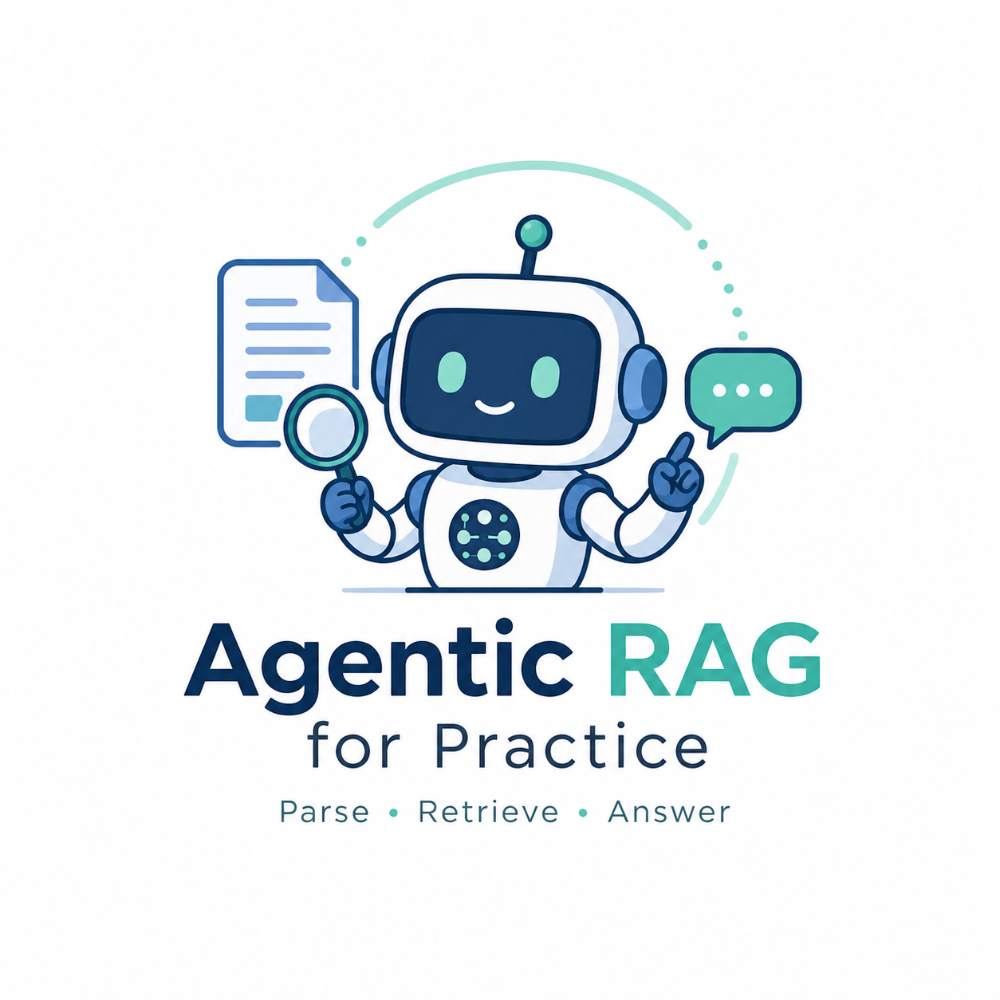
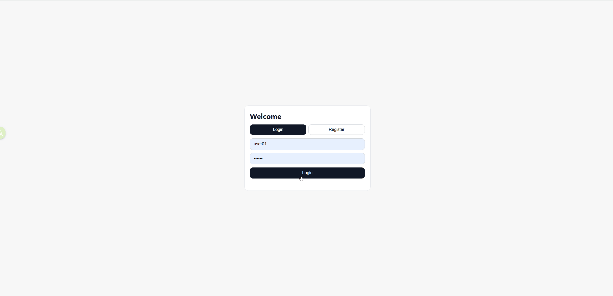

# Agentic RAG for Practice

[English](README.md)

<p align="center">
  
</p>

一个面向实践的多用户 Agentic RAG 文档问答系统。当前主入口是 FastAPI Web UI，支持文档上传、混合检索、Reranker、LangGraph 工作流、多轮对话记忆，以及文档库变化后的会话隔离。

## 演示



## 项目概览

这个项目不是单纯的“向量检索 + 大模型回答”示例，而是一个已经具备基本产品形态的 RAG 系统，重点解决：

- 私有文档问答
- 多轮对话中的上下文理解
- 文档库变化后的旧上下文污染
- 多用户文档与会话隔离
- 检索链路的可解释展示

当前主能力：

- 用户注册与登录
- PDF / Markdown 文档上传
- LlamaParse / PyMuPDF4LLM PDF 解析
- Parent-Child Chunking
- Dense + Sparse Hybrid Retrieval
- Cross-encoder Reranker
- LangGraph 编排的 Agentic RAG
- CRAG-style 检索质量判断
- 聊天历史持久化与摘要记忆
- 文档版本感知的线程刷新策略

## 项目来源

本项目基于 Giovanni Pasqualino 的原始仓库继续修改和扩展：

- Original repository: [GiovanniPasq/agentic-rag-for-dummies](https://github.com/GiovanniPasq/agentic-rag-for-dummies)

当前版本在原始思路基础上，重点改造成了：

- FastAPI 主界面与多用户登录体系
- 文档版本感知的 chat 线程刷新机制
- 回答依据展示与中间过程卡片
- CRAG-style 检索质量判断
- 上传进度、确认弹窗与更完整的文档管理
- Docker 运行与环境变量加载优化

## 当前架构

项目当前可以分成 5 层：

1. Web 层：FastAPI 页面与接口
2. Core 层：聊天、文档管理、用户状态、RAG 系统装配
3. Agent 层：LangGraph 图、节点、边、工具、提示词
4. Storage 层：Qdrant、parent store、本地聊天状态
5. Model 层：外部 OpenAI-compatible 主模型 + Ollama Embedding

典型链路如下：

```text
Upload Document
  -> PDF/Markdown preprocessing
  -> parent/child chunking
  -> child chunks into Qdrant
  -> parent chunks into parent_store
  -> documents_version bump
  -> user asks a question
  -> LLM Router
  -> LangGraph document QA flow
  -> retrieval / rerank / grading / answer
```

## 仓库结构

```text
.
├─ project/
│  ├─ app.py
│  ├─ config.py
│  ├─ document_chunker.py
│  ├─ core/
│  ├─ db/
│  ├─ rag_agent/
│  ├─ ui/
│  ├─ Dockerfile
│  ├─ README.md
│  └─ README_CN.md
├─ data/                  # 运行后生成的本地用户数据
├─ qdrant_db/             # 本地 Qdrant 数据目录
├─ requirements.txt
├─ README.md
└─ README_CN.md
```

`project/README.md` 是更偏实现与开发视角的说明；本 README 更偏整体使用与部署说明。

## 环境要求

- 推荐 Python 3.12
- 兼容 Python 3.11+
- 推荐使用 `uv` 管理虚拟环境与依赖
- 可访问的 OpenAI-compatible LLM 接口
- 本地或外部 Ollama 服务
- 已准备好 embedding 模型 `nomic-embed-text`

建议先执行：

```bash
ollama serve
ollama pull nomic-embed-text
```

## 配置方式

当前项目的配置优先级是：

1. 进程环境变量
2. `project/.env`
3. `project/config.py` 中的默认值

关键配置项：

- `LLM_MODEL`
- `LLM_BASE_URL`
- `LLM_API_KEY`
- `DENSE_MODEL`
- `DENSE_VECTOR_SIZE`
- `SPARSE_MODEL`
- `OLLAMA_HOST`
- `APP_HOST`
- `APP_PORT`
- `APP_AUTO_RELOAD`
- `CROSS_ENCODER_LOCAL_FILES_ONLY`

推荐先将 `project/.env.example` 复制并重命名为 `project/.env`：

```powershell
Copy-Item project\.env.example project\.env
```

然后补齐你自己的 `LLM_API_KEY` 与其它本地配置。

## 本地启动

### 推荐方式：使用 uv + Python 3.12

1. 如果你的本机还没有 `Python 3.12`，先让 `uv` 安装

```bash
uv python install 3.12
```

2. 在仓库根目录创建虚拟环境

```bash
uv venv --python 3.12 .venv
```

3. 激活虚拟环境

Windows PowerShell:

```powershell
.\.venv\Scripts\Activate.ps1
```

macOS / Linux:

```bash
source .venv/bin/activate
```

4. 安装依赖

```bash
uv pip install torch==2.4.1+cpu --extra-index-url https://download.pytorch.org/whl/cpu
uv pip install -r requirements.txt
```

说明：

- 之所以先单独安装 `torch`，是因为 `requirements.txt` 里的 `torch==2.4.1+cpu` 来自 PyTorch 的 CPU wheel 源，直接让 `uv` 和其它依赖一起解析时，容易出现多索引冲突。
- 如果你使用的不是 Python 3.12，可以根据自己的 Python 版本改用兼容的 Torch 版本，再执行 `uv pip install -r requirements.txt`。
- 更稳妥的做法是到 PyTorch 官方安装页面按自己的 Python 版本、CPU / CUDA 环境选择对应命令；本项目当前文档默认示例使用 CPU 版 `torch==2.4.1+cpu`。

5. 准备环境变量文件

```powershell
Copy-Item project\.env.example project\.env
```

然后补齐你自己的 `LLM_API_KEY`、`LLM_BASE_URL` 等配置。

6. 启动项目

```bash
cd project
python app.py
```

### 兼容方式：继续使用 pip

如果你不打算使用 `uv`，也可以继续使用原来的方式：

```bash
pip install -r requirements.txt
cd project
python app.py
```

默认访问地址：

```text
http://127.0.0.1:7860
```

## 使用方式

1. 注册并登录
2. 在 Documents 页面上传 PDF 或 Markdown
3. 上传时选择：
   - `Supplement Current Topic`
   - `Start New Topic`
4. 回到聊天页面提问

前端会展示本轮回答依据，例如：

- `回答依据：模型直接生成`
- `回答依据：当前文档列表`
- `回答依据：文档库概览`
- `回答依据：当前文档库检索`

## 文档刷新策略

项目当前采用“文档版本号 + chat 线程版本”机制：

- 文档库发生有效变化时，提升 `documents_version`
- 每个 chat 保存自己的 `document_context_version`
- 如果某个 chat 版本落后，它会在下次真正发送消息时切换到新的 `thread_id`
- 旧聊天记录保留展示，但不再参与后续推理

## Docker

当前推荐方案是：

- 容器内只运行 FastAPI 应用
- Ollama 作为外部 embedding 服务
- 主 LLM 通过外部 OpenAI-compatible API 提供

构建镜像：

```bash
docker build -f project/Dockerfile -t agentic-rag-fastapi .
```

推荐运行方式：

```bash
docker run --rm -p 7860:7860 --env-file project/.env agentic-rag-fastapi
```

## Public URL

当前主 UI 是 FastAPI。

- 如果想临时暴露公网地址，可以用 `cloudflared`
- 如果想长期稳定使用，建议部署到云服务器

临时暴露示例：

```bash
cloudflared tunnel --url http://127.0.0.1:7860
```

## 当前边界

- LangGraph checkpoint 仍然是内存型
- 文档覆盖更新策略还未单独实现
- 页码级 citation 尚未实现
- 删除 / 清空文档库后的 chat 默认是懒刷新，不是自动全量重置

## License

本仓库当前使用 [MIT License](LICENSE)。

This project is based on and modified from the original work by [Giovanni Pasqualino](https://github.com/GiovanniPasq/agentic-rag-for-dummies).
The original copyright notice is preserved in the LICENSE file.
